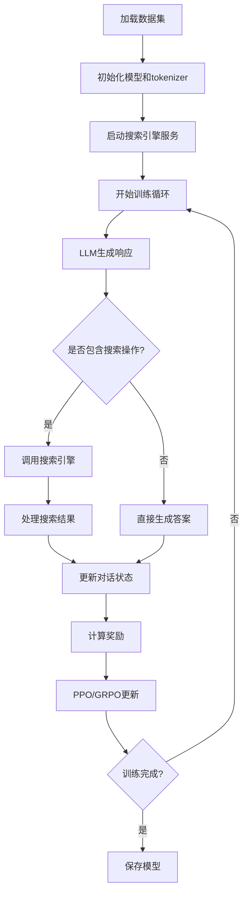
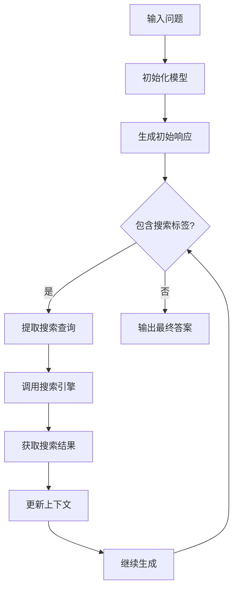

# Search-R1项目技术架构详解

## 项目概述

**Search-R1** 是一个基于强化学习的框架，专门用于训练**推理与搜索交替进行的大语言模型**。该项目扩展了DeepSeek-R1(-Zero)的思想，通过集成交替的搜索引擎访问功能，提供了一个完全开源的强化学习训练管道，可作为OpenAI DeepResearch的开源替代方案。

### 核心特性
- 🧠 **推理与搜索交替**：模型学会在推理过程中智能地调用搜索引擎
- 🔄 **强化学习训练**：支持PPO、GRPO、reinforce等多种RL算法
- 🔍 **多搜索引擎支持**：本地稀疏/稠密检索器和在线搜索引擎
- 🏗️ **基于veRL构建**：建立在火山引擎的veRL框架之上
- 📊 **多模型支持**：支持Llama3、Qwen2.5等多种LLM架构

## 项目架构

### 整体架构图

```
Search-R1
├── search_r1/           # 核心搜索和LLM代理模块
│   ├── llm_agent/       # LLM代理生成管理
│   └── search/          # 搜索引擎集成
├── verl/                # 强化学习训练框架
│   ├── trainer/         # 训练器实现
│   ├── workers/         # 分布式工作节点
│   └── models/          # 模型定义
├── scripts/             # 数据处理和工具脚本
├── docs/                # 项目文档
├── example/             # 使用示例
└── 训练脚本              # PPO/GRPO训练脚本
```

## 核心模块详解

### 1. search_r1模块

#### 1.1 llm_agent子模块

**功能**：管理LLM的生成过程和与环境的交互

**核心文件**：
- `generation.py`：LLM生成管理器
- `tensor_helper.py`：张量操作辅助工具

**关键类**：
```python
class LLMGenerationManager:
    """LLM生成管理器，负责多轮对话和搜索调用"""
    
    def run_llm_loop(self, gen_batch, initial_input_ids):
        """主生成循环，支持多轮推理和搜索"""
        for step in range(self.config.max_turns):
            # 生成响应
            gen_output = self._generate_with_gpu_padding(rollings_active)
            
            # 执行预测并处理观察结果
            next_obs, dones, valid_action, is_search = self.execute_predictions(
                responses_str, self.tokenizer.pad_token, active_mask
            )
            
            # 更新状态
            rollings = self._update_rolling_state(rollings, responses_ids, next_obs_ids)
```

**工作流程**：
1. **初始化**：设置tokenizer、配置参数和张量辅助工具
2. **多轮生成**：在最大轮数内进行推理和搜索的交替
3. **响应处理**：解析LLM输出，识别搜索操作和答案操作
4. **环境交互**：执行搜索调用，获取搜索结果
5. **状态更新**：更新对话历史和观察状态

#### 1.2 search子模块

**功能**：提供多种搜索引擎的集成和API服务

**核心文件**：
- `retrieval.py`：检索器基类和实现
- `retrieval_server.py`：本地检索服务器
- `google_search_server.py`：在线搜索引擎服务
- `index_builder.py`：索引构建工具

**支持的搜索引擎类型**：

##### 1.2.1 本地稀疏检索器（BM25）
```python
class BM25Retriever(BaseRetriever):
    """BM25稀疏检索器实现"""
    
    def _batch_search(self, queries, topk):
        """批量搜索实现"""
        scores, indices = self.indexer.search(queries, k=topk)
        return self._format_results(scores, indices)
```

**特点**：
- 无需GPU，检索效率高
- 基于传统TF-IDF算法
- 适合通用领域检索

##### 1.2.2 本地稠密检索器（E5/BGE）
```python
class Encoder:
    """稠密检索编码器"""
    
    @torch.no_grad()
    def encode(self, query_list, is_query=True):
        """编码查询或文档"""
        # 处理不同模型的特殊前缀
        if "e5" in self.model_name.lower():
            if is_query:
                query_list = [f"query: {query}" for query in query_list]
            else:
                query_list = [f"passage: {query}" for query in query_list]
        
        # 编码和池化
        outputs = self.model(**inputs)
        embeddings = pooling(outputs.pooler_output, outputs.last_hidden_state, 
                           attention_mask, self.pooling_method)
        return embeddings
```

**特点**：
- 支持GPU加速的精确匹配（Flat Indexing）
- 支持CPU的近似最近邻搜索（ANN Indexing）
- 检索精度更高，适合特定领域

##### 1.2.3 在线搜索引擎
```python
class OnlineSearchEngine:
    """在线搜索引擎接口"""
    
    def search(self, queries, topk=3):
        """执行在线搜索"""
        results = []
        for query in queries:
            # 调用Google/Bing/Brave等API
            search_results = self._call_search_api(query)
            results.append(self._format_results(search_results))
        return results
```

**特点**：
- 支持Google、Bing、Brave等主流搜索引擎
- 需要API密钥和网络连接
- 适合通用知识检索

### 2. verl模块（强化学习框架）

#### 2.1 训练器架构

**核心训练器**：
- `RayPPOTrainer`：基于Ray的分布式PPO训练器
- `main_ppo.py`：PPO训练主程序
- `main_ppo_format.py`：带格式奖励的PPO训练

**训练流程**：
```python
def fit(self):
    """PPO训练主循环"""
    for epoch in range(self.config.trainer.total_epochs):
        for batch_dict in self.train_dataloader:
            # 生成序列
            if not self.config.do_search:
                gen_batch_output = self.actor_rollout_wg.generate_sequences(gen_batch)
            else:
                # 使用LLM代理进行多轮生成
                gen_batch_output = self.llm_generation_manager.run_llm_loop(gen_batch, initial_input_ids)
            
            # 计算奖励
            rewards = self.reward_fn.compute_reward(batch)
            
            # PPO更新
            self._ppo_update(batch, rewards)
```

#### 2.2 奖励机制

**奖励类型**：
1. **格式奖励**：确保输出符合指定格式
2. **检索奖励**：鼓励有效的搜索调用
3. **最终答案奖励**：基于答案正确性的奖励

**奖励管理器**：
```python
class RewardManager:
    """多源奖励管理器"""
    
    def compute_reward(self, batch):
        """计算综合奖励"""
        rewards = []
        
        # 格式奖励
        if self.structure_format_score:
            format_rewards = self._compute_format_rewards(batch)
            rewards.append(format_rewards)
        
        # 检索奖励
        if self.retrieval_score:
            retrieval_rewards = self._compute_retrieval_rewards(batch)
            rewards.append(retrieval_rewards)
        
        # 最终答案奖励
        final_rewards = self._compute_final_rewards(batch)
        rewards.append(final_rewards)
        
        return self._combine_rewards(rewards)
```

#### 2.3 分布式训练

**资源管理**：
- 支持多GPU、多节点训练
- 基于Ray的分布式计算
- FSDP和Megatron并行策略

**工作节点类型**：
- `ActorRolloutWorker`：负责序列生成
- `CriticWorker`：负责价值函数估计
- `RewardModelWorker`：负责奖励计算

### 3. 训练脚本

#### 3.1 PPO训练脚本（train_ppo.sh）

**关键配置**：
```bash
# 模型配置
export BASE_MODEL='meta-llama/Llama-3.2-3B'
export EXPERIMENT_NAME=nq-search-r1-ppo-llama3.2-3b-em

# 训练参数
data.train_batch_size=512
data.max_prompt_length=4096
data.max_response_length=500
data.max_start_length=2048
data.max_obs_length=500

# PPO算法参数
algorithm.adv_estimator=gae
actor_rollout_ref.actor.optim.lr=1e-6
algorithm.kl_ctrl.kl_coef=0.001

# 搜索配置
max_turns=2
retriever.url="http://127.0.0.1:8000/retrieve"
retriever.topk=3
```

#### 3.2 GRPO训练脚本（train_grpo.sh）

**GRPO特点**：
- 使用Group Relative Policy Optimization
- 支持多智能体训练（n_agent=5）
- 更稳定的训练过程

**关键差异**：
```bash
algorithm.adv_estimator=grpo
actor_rollout_ref.rollout.n_agent=5
actor_rollout_ref.actor.use_kl_loss=true
actor_rollout_ref.actor.kl_loss_coef=0.001
```

## 工作流程

### 1. 训练流程



### 2. 推理流程



## 技术特点

### 1. 多轮对话支持
- 支持最多N轮的推理-搜索交替
- 动态管理对话状态和上下文
- 智能的搜索时机判断

### 2. 灵活的搜索引擎集成
- 统一的API接口设计
- 支持本地和在线搜索引擎
- 可插拔的检索器架构

### 3. 高效的训练策略
- 基于veRL的分布式训练
- 多种RL算法支持
- 内存优化的张量操作

### 4. 强大的奖励设计
- 多维度奖励函数
- 格式和内容并重的奖励机制
- 可配置的奖励权重

## 使用指南

### 1. 环境配置
```bash
# 创建环境
conda create -n searchr1 python=3.9
conda activate searchr1

# 安装依赖
pip install torch==2.4.0 --index-url https://download.pytorch.org/whl/cu121
pip install -e .
```

### 2. 启动搜索引擎
```bash
# 启动BM25检索服务
python search_r1/search/retrieval_server.py \
    --index_path /path/to/bm25_index \
    --corpus_path /path/to/corpus.jsonl \
    --topk 3 \
    --retriever_name bm25
```

### 3. 开始训练
```bash
# PPO训练
bash train_ppo.sh

# GRPO训练
bash train_grpo.sh
```

### 4. 模型推理
```bash
# 使用训练好的模型进行推理
python infer.py
```

## 实验配置

### 1. 数据集支持
- **Natural Questions (NQ)**：自然问题数据集
- **HotpotQA**：多跳推理数据集
- **其他QA数据集**：支持自定义数据集

### 2. 模型规模
- **3B模型**：Llama-3.2-3B, Qwen2.5-3B
- **7B模型**：Llama-3.1-8B, Qwen2.5-7B
- **更大规模**：支持14B、32B等大模型

### 3. 训练策略
- **学习率**：1e-6（Actor），1e-5（Critic）
- **批次大小**：512（训练），256（验证）
- **训练轮数**：15个epoch
- **最大轮数**：2轮推理-搜索交替

## 性能优化

### 1. 内存优化
- **梯度检查点**：减少内存占用
- **参数卸载**：将参数卸载到CPU
- **张量并行**：支持多GPU并行

### 2. 计算优化
- **VLLM集成**：高效的推理引擎
- **Flash Attention**：优化的注意力计算
- **混合精度**：FP16/BF16训练

### 3. 存储优化
- **检查点管理**：定期保存模型状态
- **日志记录**：WandB集成监控
- **分布式存储**：支持HDFS等分布式文件系统

## 扩展性

### 1. 自定义搜索引擎
- 实现`BaseRetriever`接口
- 支持自定义API格式
- 可集成领域特定检索器

### 2. 自定义奖励函数
- 继承`RewardManager`类
- 实现多维度奖励计算
- 支持动态奖励权重

### 3. 自定义模型架构
- 支持HuggingFace模型
- 兼容不同tokenizer
- 支持自定义生成策略

## 总结

Search-R1是一个功能完整、架构清晰的强化学习框架，专门用于训练具备搜索能力的大语言模型。其核心优势在于：

1. **完整的训练管道**：从数据预处理到模型部署的完整流程
2. **灵活的搜索引擎集成**：支持多种检索策略和搜索引擎
3. **高效的分布式训练**：基于veRL的强大训练能力
4. **丰富的实验配置**：支持多种模型规模和训练策略
5. **良好的扩展性**：易于定制和扩展的模块化设计

该项目为大语言模型的工具使用能力训练提供了重要的开源解决方案，为相关研究和应用提供了坚实的基础。
